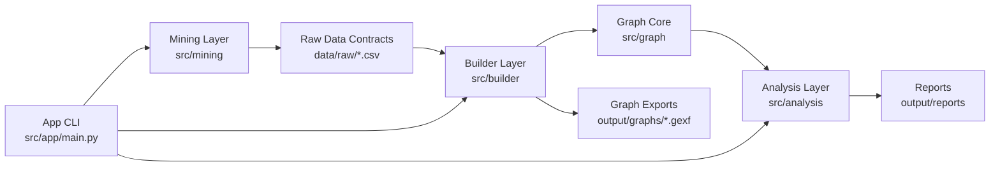
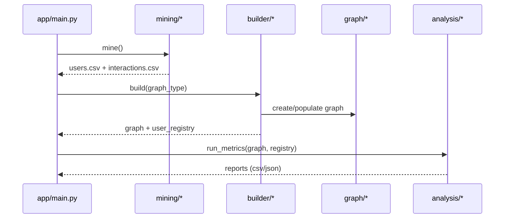

# Project Architecture Blueprint

Generated on: 2026-05-25
Repository: TrabalhoGrafos
Primary analyed project: github-graph-analyzer

## 0. Repository Structure Detection

### Detection Summary
- Root contains one implementation sub-project: `github-graph-analyzer/`.
- Root also contains governance/documentation assets under `.github/` and a meta `README.md`.
- No evidence of multiple independent runnable application projects (no sibling manifests for separate apps such as additional `requirements.txt`, `package.json`, `go.mod`, `Cargo.toml`, etc.).
- No workspace orchestrator detected at root (no `pnpm-workspace.yaml`, `turbo.json`, `nx.json`, etc.).

### Conclusion
This repository is treated as a **single-project architecture** with supporting documentation assets.

## 1. Architecture Detection and Analysis

### Technology Stack (Detected)
- Language: Python (target declared in `README.md` as Python 3.10+).
- Dependency manager: Intended `pip + requirements.txt`.
- Testing framework: Intended `pytest`.
- Data/IO format: CSV and JSON (declared by docs and folder contracts).
- External API: GitHub REST via PyGithub (declared in docs).
- Visualization export target: GEXF for Gephi (declared in docs).

### Current Implementation State
- Source modules under `github-graph-analyzer/src/**` are currently placeholders (empty files).
- Tests under `github-graph-analyzer/tests/**` are placeholders (empty files).
- Runtime entrypoints in `src/app/main.py` and `src/app/api_demo.py` are placeholders.
- `github-graph-analyzer/requirements.txt` is empty.

### Architectural Pattern (Detected)
- **Primary pattern (design intent): Layered architecture with pipeline orchestration**.
- **Observed state (runtime reality): Skeleton architecture with defined boundaries, no implemented runtime dependencies yet**.

## 2. Architectural Overview

The project defines a 4-stage graph analytics pipeline for GitHub collaboration analysis:

1. Mining layer: collect interactions from GitHub.
2. Graph layer: graph abstractions and concrete representations.
3. Builder layer: convert mined interactions into graph instances.
4. Analysis layer: compute metrics and generate reports.

An app layer is intended to orchestrate the pipeline and provide an API demo script.

### Guiding Principles (Evident in project docs)
- Implement graph structures and algorithms from scratch.
- Keep graph API abstract and representation-agnostic.
- Keep mining contracts explicit through CSV schemas.
- Keep analysis independent from specific graph implementation.

### Architectural Boundaries
- Boundaries are currently documented by folder and file naming conventions.
- Enforcement in code (imports, interfaces, tests, CI checks) is not yet present due to placeholder state.

## 3. Architecture Visualization

### High-Level Component View



### Intended Request/Process Sequence



## 4. Core Architectural Components

### Mining Component (`src/mining`)
- Purpose: Integrate with GitHub API and normalize interactions.
- Internal structure (planned): client, miners by artifact type, interaction model, exporters.
- Interaction pattern: outputs CSV files consumed by builders.
- Evolution points: add new interaction types via miner-specific modules and schema extension.

### Graph Component (`src/graph`)
- Purpose: Provide abstract graph API plus matrix/list implementations.
- Internal structure (planned): abstract contract, concrete implementations, exceptions, exporter.
- Interaction pattern: consumed by builders and analysis.
- Evolution points: additional graph representations, weighted/temporal extensions.

### Builder Component (`src/builder`)
- Purpose: Translate interaction records into graph instances and maintain user-index mapping.
- Internal structure (planned): base builder + graph-specific builders + registry.
- Interaction pattern: consumes mining output, emits graph + registry.
- Evolution points: add new graph synthesis rules and weighting policies.

### Analysis Component (`src/analysis`)
- Purpose: Compute centrality, structure, and community metrics.
- Internal structure (planned): modules by metric family.
- Interaction pattern: consumes graph abstraction and emits report artifacts.
- Evolution points: add algorithms while preserving graph abstraction API compatibility.

### App Component (`src/app`)
- Purpose: Orchestrate full pipeline and demonstrate graph API usage.
- Internal structure (planned): main CLI + API demo script.
- Interaction pattern: pipeline coordinator only; should avoid domain logic ownership.
- Evolution points: add command flags, validation, and run profiles.

## 5. Architectural Layers and Dependencies

### Intended Layer Map
- Layer 1: Mining (`src/mining`)
- Layer 2: Graph Core (`src/graph`)
- Layer 3: Builders (`src/builder`)
- Layer 4: Analysis (`src/analysis`)
- Layer 5: Application Orchestration (`src/app`)

### Intended Dependency Rules
- `app` may depend on `mining`, `builder`, `analysis`, and optionally graph abstractions.
- `builder` may depend on `graph` and interaction contracts.
- `analysis` should depend on `graph` abstractions only, not builder internals.
- `graph` should be foundational and not depend on higher layers.

### Current Validation
- Circular dependencies cannot be assessed from runtime code yet.
- Dependency injection patterns are not implemented yet.

## 6. Data Architecture

### Domain Model (Planned)
- User identity (login, id, display attributes).
- Interaction edge (source user, target user, interaction type, weight, timestamp, source artifact id).
- Graph entities (vertices, edges, optional weights).

### Data Stores and Formats
- Raw extraction outputs in CSV under `data/raw/`.
- Analysis outputs in CSV/JSON under `output/reports/`.
- Graph export in GEXF under `output/graphs/`.

### Data Access Patterns
- Planned file-based ETL style processing.
- No database or ORM currently detected.

### Validation and Mapping
- Input schema validation is planned but not implemented yet.
- Mapping rules are documented in README contracts, not encoded in code yet.

## 7. Cross-Cutting Concerns Implementation

### Authentication and Authorization
- Intended pattern: token-based access to GitHub API through `.env` configuration.
- Current state: no implemented auth flow in code.

### Error Handling and Resilience
- Intended pattern: rate-limit handling and retry strategy in `github_client.py`.
- Current state: not implemented.

### Logging and Monitoring
- No concrete logging/monitoring implementation detected.
- Recommended baseline: structured logs per pipeline stage + progress counters.

### Validation
- No concrete input/business validation implementation detected.
- Recommended baseline: schema checks before builder stage.

### Configuration Management
- `.env.example` present, indicating environment-driven configuration intent.
- No settings loader implemented yet.

## 8. Service Communication Patterns

### Boundaries and Protocols
- Internal boundaries are module/layer based.
- External communication is expected through GitHub REST API.
- Internal communication is synchronous in-process Python calls.

### API Versioning / Discovery
- Not applicable for internal modules at current state.
- External API versioning delegated to GitHub API client library.

### Resilience in Service Communication
- Intended: retries and rate-limit awareness in mining client.
- Actual: not implemented yet.

## 8.5. Background Tasks and Scheduled Jobs

- No schedulers, workers, queue frameworks, cron definitions, or timer loops detected.
- Current execution model is expected to be manual CLI invocation.

## 8.7. External Service Integrations

### Detected Integration
- Service: GitHub API (declared intent only).
- API type: REST via PyGithub wrapper.
- Auth model: personal access token from environment variable.

### Current Coupling Assessment
- Planned design appears moderately coupled to GitHub artifact model (issues, PRs, reviews, events).
- No adapter abstraction exists yet to swap provider without touching miners.

## 8.8. Infrastructure as Code

- No IaC assets detected (Terraform, Dockerfile, docker-compose, Kubernetes manifests, CI workflows in active use for this app runtime).
- Repository has `.github/` directories mostly for agent/skill docs, not deployment IaC.

## 8.9. Data Pipeline Architecture

- Pipeline pattern exists as project intent (mine -> build -> analyze), but no executable pipeline code yet.
- Processing mode appears designed as batch, file-backed stages.
- No orchestration framework (Airflow/Prefect/etc.) detected.

## 9. Python-Specific Architectural Patterns

### Module Organization
- Feature/layer-oriented package structure under `src/`.
- `__init__.py` files present but empty.

### Framework Detection
- No web framework runtime code detected (Django/FastAPI/Flask absent).
- This is a CLI-oriented data/mining and algorithmic project design.

### Dependency Management
- Intended `requirements.txt`, currently empty.
- `.env.example` indicates planned local virtualenv + env-var workflow.

### OOP vs Functional Balance
- Planned object-oriented boundaries (graph classes, builders, client wrappers).
- Actual implementation pending.

### Async Patterns
- No async usage detected.
- Likely synchronous batch process by design.

### Type Hinting
- Type hints are referenced by docs as convention.
- No implemented signatures to validate yet.

## 10. Implementation Patterns

This section captures implementation-ready patterns that fit the declared architecture.

### Interface Design Pattern
- Create `AbstractGraph` as the stable contract for all algorithms.
- Keep analysis functions dependent on `AbstractGraph` methods only.
- Use custom domain exceptions for boundary validation.

### Service Implementation Pattern
- Mining services should be stateless per run and receive config/client via constructor.
- Builder services should expose a deterministic `build()` method returning `(graph, registry)`.

### Repository/Data Access Pattern
- Treat CSV reader/writer classes as data access boundary.
- Keep schema constants centralized to avoid drift between miners/builders.

### Controller/API Pattern (CLI)
- Command handler per stage (`--mine`, `--build`, `--analyze`, `--all`).
- Fail-fast on missing prerequisites (for example, `--build` without raw data).

### Domain Model Pattern
- Use dataclasses for interaction events.
- Keep edge type and weight policies centralized as enums/constants.

## 11. Testing Architecture

### Current State
- Test files exist but are empty placeholders.

### Recommended Strategy Aligned to Architecture
- Unit tests for graph operations and exceptions.
- Contract tests for CSV schemas between mining and builder.
- Integration tests for end-to-end pipeline from synthetic interactions to reports.
- Golden-file tests for GEXF export and report outputs.

### Tooling
- Pytest as test runner.
- Coverage target >= 80 percent per layer (as declared in docs).

## 12. Deployment Architecture

### Current Deployment Model
- Local CLI execution in developer machine/academic environment.
- No containerization, no cloud runtime, no deployment manifests.

### Runtime Dependencies
- Python interpreter + pip dependencies + GitHub token.
- Filesystem write access to `data/raw`, `output/graphs`, `output/reports`.

## 13. Extension and Evolution Patterns

### Feature Addition Patterns
- New interaction type:
  1. Extend interaction type constants.
  2. Add/extend miner extraction logic.
  3. Update builder filtering/weighting rules.
  4. Add analysis coverage and report fields.
  5. Add tests for full stage propagation.

- New analysis algorithm:
  1. Add module/function under `src/analysis`.
  2. Depend only on graph abstraction.
  3. Register in CLI analyze command.
  4. Add deterministic fixture-based tests.

### Modification Patterns
- Preserve `AbstractGraph` API backward compatibility whenever possible.
- Version report schemas if breaking column changes are required.
- Prefer additive CSV schema evolution over in-place breaking changes.

### Integration Patterns
- For new external providers, add adapter layer under `src/mining` and map into internal `Interaction` model.
- Keep provider-specific fields out of core graph/analyze layers.

## 14. Architectural Pattern Examples

### Example 1: Layer Separation Through Contract

```python
# src/graph/abstract_graph.py
from abc import ABC, abstractmethod

class AbstractGraph(ABC):
    @abstractmethod
    def add_edge(self, u: int, v: int) -> None:
        ...
```

```python
# src/analysis/centrality.py
from src.graph.abstract_graph import AbstractGraph

def degree_centrality(graph: AbstractGraph) -> dict[int, float]:
    # Uses graph contract only, not concrete representation details.
    ...
```

### Example 2: Builder Contract

```python
# src/builder/base_builder.py
class BaseBuilder:
    def build(self):
        # read interactions.csv -> populate graph -> return graph + registry
        ...
```

### Example 3: CLI Orchestration

```python
# src/app/main.py
# if args.all: mine(); build(); analyze()
# if args.mine: mine()
```

## 15. Architectural Decision Records

### ADR-01: Custom Graph Implementation
- Context: Academic requirement prohibits graph libraries.
- Decision: Implement adjacency matrix and adjacency list from scratch.
- Consequences: High learning value and control; higher implementation/testing effort.

### ADR-02: Layered Pipeline by Data Stage
- Context: Distinct concerns: collection, modeling, construction, analysis.
- Decision: Use stage-specific folders and contracts.
- Consequences: Clear responsibilities; requires strict schema/version discipline.

### ADR-03: File-Based Intermediate Contracts
- Context: Team parallel development by fronts.
- Decision: Exchange through CSV outputs between stages.
- Consequences: Easy debug and reproducibility; requires robust schema validation.

### ADR-04: Representation-Agnostic Analysis
- Context: Need to support matrix and list graph structures.
- Decision: Analysis depends on abstract graph API only.
- Consequences: Better extensibility; requires complete and stable graph interface.

## 16. Architecture Governance

### Current Governance Signals
- Naming conventions and responsibilities are well documented in README files.
- Team process conventions are documented (branching, commit style, PR review).

### Missing Automated Governance
- No CI checks detected for architecture constraints.
- No lint/type/test gates are currently executable due placeholder implementation.

### Recommended Governance Controls
- Add import-layer guard checks.
- Add schema contract tests for CSV boundaries.
- Add minimal CI workflow: lint -> test -> coverage threshold.

## 17. Blueprint for New Development

### Development Workflow
1. Start from one layer at a time with tests first for contracts.
2. Implement graph core and exceptions before builders/analysis.
3. Implement mining adapters and CSV exporter.
4. Implement builders and registry translation.
5. Implement analysis metrics with fixture graphs.
6. Wire CLI orchestration and run end-to-end tests.

### Implementation Templates

#### Template: New Analysis Function
```python
from src.graph.abstract_graph import AbstractGraph

def metric_name(graph: AbstractGraph) -> dict:
    # validate graph preconditions
    # compute metric deterministically
    return {}
```

#### Template: New Miner
```python
class ExampleMiner:
    def __init__(self, client):
        self.client = client

    def mine(self) -> list:
        # fetch source artifacts
        # normalize into Interaction records
        return []
```

#### Template: New Builder
```python
class ExampleBuilder:
    def __init__(self, graph_factory, registry):
        self.graph_factory = graph_factory
        self.registry = registry

    def build(self):
        # read interactions
        # filter by type
        # map users to indices
        # add weighted edges
        return None
```

### Common Pitfalls
- Mixing provider-specific fields into core graph or analysis logic.
- Tight coupling of analysis to one concrete graph implementation.
- Silent CSV schema drift between mining and builder.
- Lack of deterministic fixtures for algorithm testing.
- Implementing features without updating CLI and report contracts.

### Update Cadence Recommendation
- Refresh this blueprint after each milestone or major refactor.
- Keep ADR section updated when architectural choices change.
- Link blueprint updates with test suite expansion to keep architecture executable.
